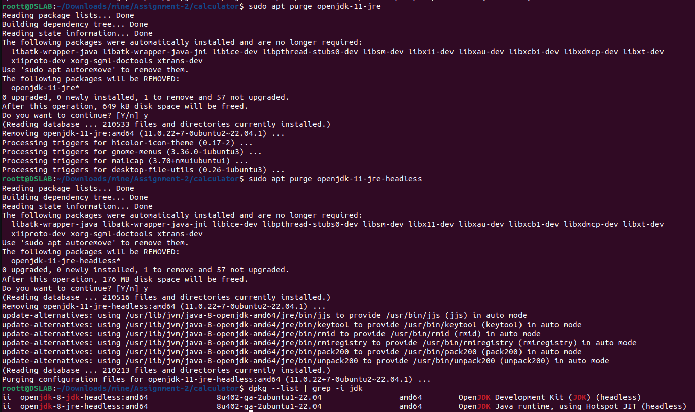

# SPPU-BE-IT-DS
#### Important Requirements & Prerequisites
- java 8
```bash
# install java 8 on Ubuntu
sudo apt update 
sudo apt install openjdk-8-jdk -y
# to check if you have multiple version of java and setting default to java 8
sudo update-alternatives --config java
```

```bash
# now other versions of java needs to be deleted 
# if not deleted Assignment2 will cause an error
# fist list the installed java versions using this command
dpkg --list | grep -i jdk
# now use this command to remove all the components of other version
sudo apt purge openjdk-11-jdk
sudo apt purge openjdk-11-jdk-headless
sudo apt purge openjdk-11-jre
sudo apt purge openjdk-11-jre-headless
# now check again if only java 8 present
dpkg --list | grep -i jdk
```



- Downlaod java 8 for windows from [Link1](https://builds.openlogic.com/downloadJDK/openlogic-openjdk/8u412-b08/openlogic-openjdk-8u412-b08-windows-x64.msi) or [Link2](https://www.openlogic.com/openjdk-downloads?field_java_parent_version_target_id=416&field_operating_system_target_id=436&field_architecture_target_id=391&field_java_package_target_id=396 
)
<hr>

#### Assignment 1
1. Terminal 1
    ```bash
    # compile all java files
    javac *.java
    # compile implementation file
    rmic ServerImplementation
    # start rmiregistry
    rmiregistry

    ```
2. Terminal 2
    ```bash
    # start the server
    java Server
    ```
3. Terminal 3
    ```bash
    # connect the client
    # for addtion, substraction, division, multiplication
    java Client 10 20
    # for square, square root
    java Client 25
    # for string equal
    java Client abc abc
    # for palindrome
    java Client aba
    ```
<hr>

#### Assignment 2
1. Terminal 1
    ```bash
    # complile all the files
    idlj -fall ServiceModule.idl
    javac *.java ServiceModule/*.java
    # start orbd 
    orbd -ORBInitialPort 1056
    ```
2. Terminal 2
    ```bash
    # start the server
    java ServiceServer -ORBInitialPort 1056
    ```
3. Terminal 3
    ```bash
    # connect the client
    java ServiceClient -ORBInitialPort 1056 -ORBInitialHost localhost
    ```
<hr>

#### Assignment 3
- MPI setup
- Download [MPJ Express](https://sourceforge.net/projects/mpjexpress/files/releases/mpj-v0_44.tar.gz/download) 
- Extract it in Downloads Folder
    ```bash
    # replace {ubuntu_username} with your machines username like ubuntu, vboxuser
    # or check username by going into home dir
    cd /home && ls
    # set MPJ_HOME env variable
    export MPJ_HOME=/home/{ubuntu_username}/Downloads/mpj-v0_44
    # update PATH env variable
    export PATH=$MPJ_HOME/bin:$PATH
    # compile the java program
    javac -cp $MPJ_HOME/lib/mpj.jar ArrSum.java
    # run compiled java program
    $MPJ_HOME/bin/mpjrun.sh -np 4 ArrSum
{example

vm1@vm1-VirtualBox:~/Downloads$ cd /home && ls
vm1
vm1@vm1-VirtualBox:/home$ export MPJ_HOME=/home/{ubuntu_username}/Downloads/mpj-v0_44
vm1@vm1-VirtualBox:/home$ export MPJ_HOME=/home/vm1/Downloads/mpj-v0_44
vm1@vm1-VirtualBox:/home$ export PATH=$MPJ_HOME/bin:$PATH
vm1@vm1-VirtualBox:/home$ javac -cp $MPJ_HOME/lib/mpj.jar /home/vm1/Downloads/BE-IT-DS-main/Assign3/ArrSum.java
vm1@vm1-VirtualBox:/home$ $MPJ_HOME/bin/mpjrun.sh -np 4 -cp /home/vm1/Downloads/BE-IT-DS-main/Assign3 ArrSum


}

    ```
<hr>

#### Assignment 4
1. Terminal 1
    ```bash
    python server.py
    # or 
    python3 server.py
    ```
2. Terminal 2
    ```bash
    python client.py
    #or
    python3 client.py
    ```
<hr>

#### Assignment 5
- Terminal 1
    ```bash
    # complile the java program
    javac TokenRing.java
    # run compiled java program
    java TokenRing
    ```
<hr>

#### Assignment 6
- Terminal 1
    ```bash
    # compile the java program
    javac Bully.java
    javac Ring.java
    # run compiled java program
    java Bully
    java Ring
    ```

<hr>

#### Download Repo zip without git in terminal

```bash
# git clone for ubuntu
git clone https://github.com/b1ink0/SPPU-BE-IT-DS.git

# in cmd
curl -L -o SPPU-BE-IT-DS-main.zip https://github.com/b1ink0/SPPU-BE-IT-DS/archive/refs/heads/main.zip

# or in powershell
Invoke-WebRequest -Uri "https://github.com/b1ink0/SPPU-BE-IT-DS/archive/refs/heads/main.zip" -OutFile "SPPU-BE-IT-DS-main.zip"
```
